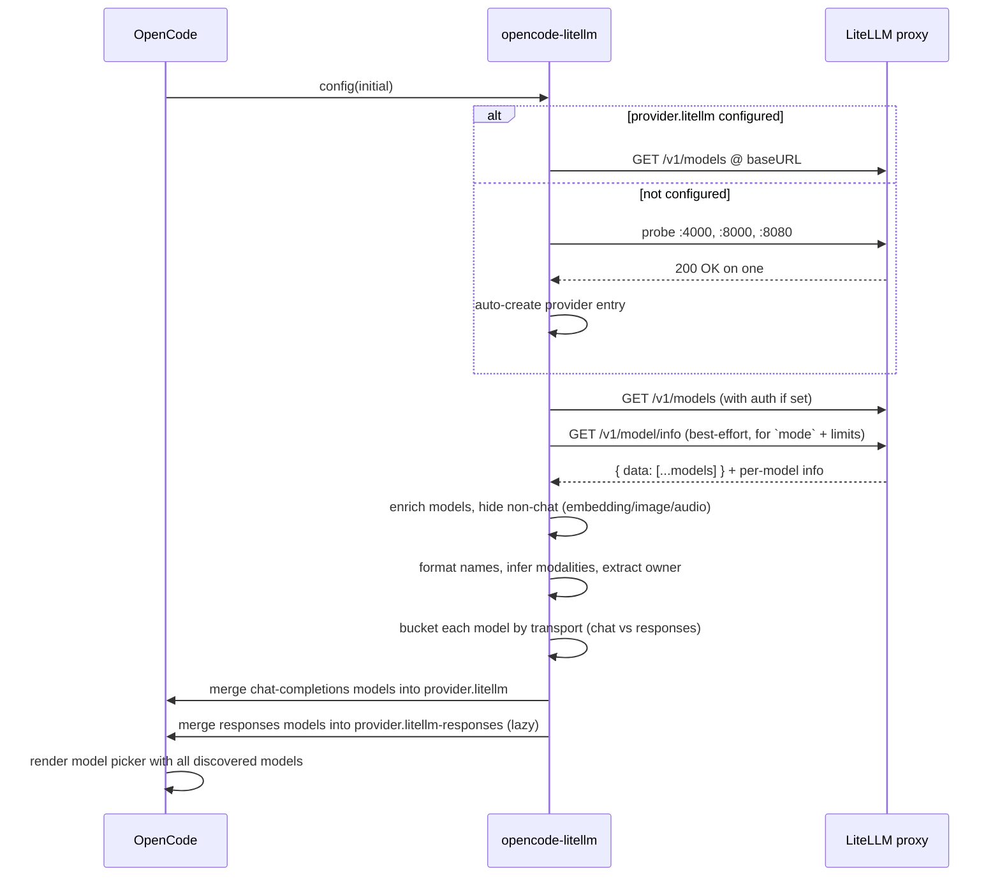

<div align="center">


# opencode-litellm

**Drop-in [LiteLLM](https://github.com/BerriAI/litellm) provider for [OpenCode](https://opencode.ai) with zero configuration.**

[](https://opencode.ai)
[](https://github.com/BerriAI/litellm)

[](https://www.npmjs.com/package/opencode-plugin-litellm)
[](https://www.npmjs.com/package/opencode-plugin-litellm)
[](https://github.com/yuseferi/opencode-litellm/actions/workflows/ci.yml)
[](./LICENSE)
[](./tsconfig.json)
[](./CONTRIBUTING.md)

Auto-detect a running LiteLLM proxy, pull every model from `/v1/models`, and register them in OpenCode.
**No model lists to hand-maintain. No restart loops. No surprises.**

[Quickstart](#-quickstart) · [Configuration](#%EF%B8%8F-configuration) · [How it works](#-how-it-works) · [FAQ](#-faq) · [Contributing](./CONTRIBUTING.md)

</div>

> **npm package:** `opencode-plugin-litellm` &nbsp;·&nbsp; **GitHub repo:** `yuseferi/opencode-litellm`
> The unscoped `opencode-litellm` npm name was already taken by another author.

---

## ✨ Why this plugin?

Maintaining a `models` block in `opencode.json` for every model your LiteLLM proxy exposes is a chore — every new entry in your `model_list` means a config edit, a restart, and a context-switch.

`opencode-litellm` removes that loop entirely. It hooks into OpenCode's `config` lifecycle, queries your LiteLLM proxy at startup, and merges the discovered models into your config in memory. The result: every model in `litellm config.yaml` shows up in OpenCode's picker the moment you start it — automatically.

## 🚀 Quickstart

```bash
# 1. Install
npm install opencode-plugin-litellm
# or: bun add opencode-plugin-litellm
```

```jsonc
// 2. Add to opencode.json
{
  "$schema": "https://opencode.ai/config.json",
  "plugin": ["opencode-plugin-litellm@latest"],
  "provider": {
    "litellm": {
      "npm": "@ai-sdk/openai-compatible",
      "options": {
        "baseURL": "http://localhost:4000/v1"
      }
    }
  }
}
```

```bash
# 3. Start LiteLLM (if it isn't already)
litellm --config config.yaml --port 4000

# 4. Run OpenCode — every model in your LiteLLM model_list is now available.
opencode
```

## 🎯 Features

| | |
|---|---|
| 🔍 **Auto-detection** | Probes `localhost:4000`, `:8000`, `:8080` and adopts the first responsive proxy. |
| 📡 **Dynamic discovery** | Queries `/v1/models` so your OpenCode model picker always reflects your live `model_list`. |
| 🏷️ **Smart formatting** | Turns `anthropic/claude-3-5-sonnet` into `Claude 3 5 Sonnet` in the picker — handles versions, sizes, quantizations, and brand-cased names like `gpt-4o`. |
| 🧠 **Modality-aware** | Enriches `/v1/models` entries with `/v1/model/info` (`mode`, token limits, capability flags) and hides embedding / image / audio models from the picker. |
| 🧪 **Reasoning-aware routing** | Auto-routes `gpt-5*` / `o1`/`o3`/`o4*` models through a sibling `litellm-responses` provider that uses `/v1/responses`, so tools + `reasoning_effort` actually work. Override per model via `responsesApiModels` / `chatApiModels`. |
| 🏢 **Provider extraction** | Pulls `litellm_provider` (or the `provider/model` prefix) into `organizationOwner` so models group correctly in the UI. |
| 🔐 **Auth-aware** | Honours `LITELLM_API_KEY` / `LITELLM_MASTER_KEY` env vars or `provider.litellm.options.apiKey`. |
| 🌐 **Gateway-friendly** | Supports `customHeaders` for proxies behind Cloudflare Access or other API gateways requiring extra HTTP headers. |
| ⏱️ **Non-blocking startup** | Discovery is capped at **5 s** — a slow or offline proxy never delays OpenCode boot. |
| 🤝 **Non-destructive merge** | Only adds models you don't already have configured. Hand-curated entries are preserved verbatim. |
| 🪶 **Zero runtime deps** | Only depends on `@opencode-ai/plugin`. No build step, no bundler. |
| 🔒 **TypeScript strict** | Strict-mode compiled, fully typed public API. |

## ⚙️ Configuration

### Minimal config (recommended)

Point at your LiteLLM proxy — the plugin discovers all models automatically:

```jsonc
{
  "$schema": "https://opencode.ai/config.json",
  "plugin": ["opencode-plugin-litellm@latest"],
  "provider": {
    "litellm": {
      "npm": "@ai-sdk/openai-compatible",
      "options": {
        "baseURL": "http://localhost:4000/v1"
      }
    }
  }
}
```

### Explicit provider (custom URL or auth)

You **do not need to list any models** — the plugin still discovers them from `/v1/models` automatically. Use this form only when you need to point at a non-default URL or pass an API key:

```jsonc
{
  "$schema": "https://opencode.ai/config.json",
  "plugin": ["opencode-plugin-litellm@latest"],
  "provider": {
    "litellm": {
      "npm": "@ai-sdk/openai-compatible",
      "name": "LiteLLM (proxy)",
      "options": {
        "baseURL": "http://litellm.internal.example.com/v1",
        "apiKey": "{env:LITELLM_API_KEY}"
      }
    }
  }
}
```

That's the whole config — every model in your LiteLLM `model_list` will appear in the picker.

### Overriding or curating individual models (optional)

If you want to rename a model in the picker, pin its `organizationOwner`, or otherwise hand-curate metadata, add it under `models`. The plugin **preserves your entries verbatim** and only injects discovered models whose key isn't already defined:

```jsonc
{
  "provider": {
    "litellm": {
      "options": {
        "baseURL": "http://litellm.internal.example.com/v1",
        "apiKey": "{env:LITELLM_API_KEY}"
      },
      "models": {
        "openai/gpt-4o": {
          "name": "GPT-4o (curated)",
          "organizationOwner": "openai"
        }
      }
    }
  }
}
```

Here, `openai/gpt-4o` keeps your custom name; every other model from the proxy is still discovered and added automatically.

### Reasoning models (gpt-5, o1/o3/o4)

OpenAI's reasoning-tier models reject requests that combine `reasoning_effort`
with function tools when sent to `/v1/chat/completions`. The OpenAI Responses
API (`/v1/responses`) has no such restriction, so the plugin routes those
models through a **second provider entry** named `litellm-responses` that
uses an SDK speaking the Responses API.

You don't need to do anything for the default behaviour — the plugin
detects reasoning-tier models from their id (`gpt-5*`, `o1*`, `o3*`,
`o4*`) and from LiteLLM's `mode === 'responses'` field, and creates the
sibling provider lazily.

To override the routing per model:

```jsonc
{
  "provider": {
    "litellm": {
      "options": {
        "baseURL": "http://localhost:4000/v1",

        // "auto" (default) | "chat" | "responses"
        "transport": "auto",

        // Force these into /v1/responses (highest precedence)
        "responsesApiModels": ["gpt-5-4-high", "my-custom-reasoning-model"],

        // Force these into /v1/chat/completions
        "chatApiModels": ["o1-mini-cheap"]
      }
    }
  }
}
```

The two providers share `baseURL` and `apiKey`. Models curated by hand
under either provider's `models` block are preserved verbatim, and a
discovered model is skipped if its key already exists under **either**
provider.

> **Note**: this requires LiteLLM ≥ 1.40 (which proxies `/v1/responses`)
> and an `@ai-sdk/openai` version that supports the Responses API. Older
> AI SDKs may silently fall back to chat-completions, in which case set
> `responsesApiModels` to an empty list and fix the upstream LiteLLM
> config instead (e.g. `use_responses_api: true` per model).

### Authentication

If your LiteLLM proxy requires a master key, expose it via either approach:

| Method | Example |
|---|---|
| Env var | `export LITELLM_API_KEY=sk-...` |
| Env var (alias) | `export LITELLM_MASTER_KEY=sk-...` |
| Config | `"options": { "apiKey": "{env:LITELLM_API_KEY}" }` |

The env var path lets you commit `opencode.json` without leaking secrets.

### Custom headers (Cloudflare Access, API gateways)

If your LiteLLM proxy is behind Cloudflare Access or another gateway that requires extra HTTP headers, use the `customHeaders` option:

```jsonc
{
  "provider": {
    "litellm": {
      "options": {
        "baseURL": "https://litellm.internal.example.com/v1",
        "apiKey": "{env:LITELLM_API_KEY}",
        "customHeaders": {
          "CF-Access-Client-Id": "{env:CF_ACCESS_CLIENT_ID}",
          "CF-Access-Client-Secret": "{env:CF_ACCESS_CLIENT_SECRET}"
        }
      }
    }
  }
}
```

These headers are included in every request the plugin makes during model discovery (health check and `/v1/models`). To obtain a Cloudflare Access Service Token, follow the [Cloudflare docs](https://developers.cloudflare.com/cloudflare-one/identity/service-tokens/).

## 🔧 How it works



1. On OpenCode startup the `config` lifecycle hook fires.
2. If `provider.litellm` exists, its `baseURL` is used. Otherwise common ports are probed.
3. A health check (`GET /v1/models`) verifies the proxy is reachable and authorized.
4. Models from the response are enriched with `/v1/model/info` metadata (`mode`, token limits, capability flags — `/v1/models` omits these for database-defined models) and converted into OpenCode model entries with `id`, formatted `name`, `organizationOwner`, and inferred `modalities`. Non-chat models (embedding / image / audio) are excluded from the picker.
5. Each model is bucketed by transport — reasoning-tier models (`gpt-5*`, `o1`/`o3`/`o4*`, or anything with `mode === 'responses'`) go into the `litellm-responses` provider; everything else goes into `litellm`. Per-model overrides via `responsesApiModels` / `chatApiModels` win.
6. Discovered models are merged on top of any user-defined ones — never overwriting them. A model is skipped if its key already exists under **either** provider.
7. The whole flow is wrapped in a `Promise.race` against a 5 s timeout so a slow proxy never blocks boot.

## 📋 Requirements

- [OpenCode](https://opencode.ai) ≥ 0.1.x with plugin support (`@opencode-ai/plugin ^1.0.166`)
- A running [LiteLLM](https://github.com/BerriAI/litellm) proxy:
  ```bash
  pip install 'litellm[proxy]'
  litellm --config config.yaml --port 4000
  ```
- Node.js ≥ 20 (or Bun ≥ 1.0)

## 📦 Compatibility matrix

| LiteLLM version | OpenCode version | Status |
|---|---|---|
| ≥ 1.40 | ≥ 0.1.x | ✅ Tested |
| 1.30 – 1.39 | ≥ 0.1.x | ⚠️ Should work (older `/v1/models` schema) |
| < 1.30 | any | ❌ Unsupported |

## ❓ FAQ

<details>
<summary><b>Why doesn't a model appear in OpenCode after I add it to LiteLLM?</b></summary>

OpenCode reads the plugin output once at startup. After updating `litellm config.yaml`, restart **both** LiteLLM and OpenCode to refresh the model list.
</details>

<details>
<summary><b>Can I use this with a remote LiteLLM proxy?</b></summary>

Yes. Set `provider.litellm.options.baseURL` to your remote URL and (optionally) `apiKey`. Auto-detection only probes `localhost`, but explicit configuration works against any URL.
</details>

<details>
<summary><b>What happens if LiteLLM is offline at startup?</b></summary>

The plugin logs a warning and is a no-op. OpenCode starts normally; you just won't see LiteLLM-discovered models until you restart with the proxy up.
</details>

<details>
<summary><b>Will my hand-curated model entries be overwritten?</b></summary>

No. The merge is additive: anything you've already defined under `provider.litellm.models` is preserved exactly as-is. Discovered models are only added if their key isn't already present.
</details>

<details>
<summary><b>Why is the npm name <code>opencode-plugin-litellm</code> and not <code>opencode-litellm</code>?</b></summary>

The unscoped `opencode-litellm` was already published by another author when this project was started. The GitHub repo and exported plugin symbol still use the cleaner `opencode-litellm` name.
</details>

<details>
<summary><b>Does this work with Ollama through LiteLLM?</b></summary>

Yes — anything in your LiteLLM `model_list` shows up, including Ollama, Bedrock, Azure, OpenAI, Anthropic, Google, etc. That's the whole point of LiteLLM.
</details>

<details>
<summary><b>My LiteLLM proxy is behind Cloudflare Access — how do I authenticate?</b></summary>

Cloudflare Access intercepts requests before they reach LiteLLM, so a plain `Authorization: Bearer` header isn't enough. Create a [Cloudflare Access Service Token](https://developers.cloudflare.com/cloudflare-one/identity/service-tokens/) and pass the credentials via `customHeaders`:

```jsonc
{
  "provider": {
    "litellm": {
      "options": {
        "baseURL": "https://litellm.your-company.com/v1",
        "customHeaders": {
          "CF-Access-Client-Id": "{env:CF_ACCESS_CLIENT_ID}",
          "CF-Access-Client-Secret": "{env:CF_ACCESS_CLIENT_SECRET}"
        }
      }
    }
  }
}
```

The `customHeaders` map works for any gateway that requires extra HTTP headers — not just Cloudflare.
</details>

<details>
<summary><b>I get <code>Function tools with reasoning_effort are not supported … in /v1/chat/completions</code> — what do I do?</b></summary>

This error comes from OpenAI: their reasoning-tier models (gpt-5, o1, o3, o4) refuse function-tool calls on `/v1/chat/completions` when `reasoning_effort` is set. They require `/v1/responses` instead.

As of `0.2.0`, `opencode-litellm` automatically routes those models through a sibling `litellm-responses` provider that uses the Responses API. If your model id doesn't match the heuristic (e.g. you renamed it in LiteLLM), add it explicitly:

```jsonc
"provider": {
  "litellm": {
    "options": {
      "responsesApiModels": ["my-renamed-gpt-5-high"]
    }
  }
}
```

The model will appear under the **LiteLLM (responses)** provider in the picker; pick it from there and tool-calling will work.
</details>

<details>
<summary><b>Why are there suddenly two providers (<code>litellm</code> and <code>litellm-responses</code>) in the picker?</b></summary>

Same LiteLLM proxy, different transport. `litellm` talks to `/v1/chat/completions`; `litellm-responses` talks to `/v1/responses`. The split is required for OpenAI reasoning models — see the FAQ entry above.

The responses provider is created lazily and only appears if at least one discovered model needs it. To collapse everything back into a single provider, set `"transport": "chat"` in `provider.litellm.options` (you'll lose tool-calling on reasoning models in exchange).
</details>

## 🛠️ Development

```bash
git clone https://github.com/yuseferi/opencode-litellm.git
cd opencode-litellm
npm install
npm run typecheck
```

The project is intentionally tiny:

```
src/
├── index.ts                    # Public exports
├── types/index.ts              # LiteLLM API types
├── utils/
│   ├── litellm-api.ts          # health check, discovery, auto-detect
│   └── format-model-name.ts    # owner extraction, name formatting, categorization
└── plugin/
    ├── index.ts                # LiteLLMPlugin entry
    ├── config-hook.ts          # OpenCode config-lifecycle hook (5 s timeout)
    └── enhance-config.ts       # core merge logic
```

See [`CONTRIBUTING.md`](./CONTRIBUTING.md) for the full contributor workflow.

## 🗺️ Roadmap

- [ ] Optional cost/latency overlay using LiteLLM's `/spend` and `/health` endpoints
- [ ] In-memory cache with TTL to avoid re-querying on rapid restarts
- [ ] Model categorization based on `litellm.proxy.config.model_list[].model_info`
- [ ] Tests with [vitest](https://vitest.dev/)
- [ ] `chat.params` hook for injecting LiteLLM routing tags / fallbacks

Have an idea? [Open an issue](https://github.com/yuseferi/opencode-litellm/issues/new).

## 🙏 Acknowledgements

Inspired by [`opencode-lmstudio`](https://github.com/agustif/opencode-lmstudio) by [@agustif](https://github.com/agustif) — the architectural blueprint for OpenCode model-discovery plugins.

Built on top of [LiteLLM](https://github.com/BerriAI/litellm) by the [BerriAI](https://github.com/BerriAI) team and [OpenCode](https://opencode.ai) by the OpenCode contributors.

## 📄 License

[MIT](./LICENSE) © [Yusef Mohamadi](https://github.com/yuseferi)

---

<div align="center">

If this project saved you time, consider giving it a ⭐ on [GitHub](https://github.com/yuseferi/opencode-litellm).

</div>
